# NEXORA: Vitrine de Testes Reais para Startups

> **MVP atual:** demanda → proposta → entrega → avaliação. Consulte
> [arquitetura](docs/architecture.md) e [ambiente de desenvolvimento](docs/development.md).
> O texto abaixo documenta o escopo histórico. Investidores agora são leitores privados;
> revelação de identidade, auditorias, editais e eventos não estão implementados no MVP.

> **Projeto Integrador — Imersão na Problemática, Engenharia de Dados e Protótipo**

---

## 👥 Equipe do Projeto

* **João Pedro** — CTO / Líder Técnico
* **Victor Torres** — Desenvolvedor Frontend
* **Luis Augusto** — Desenvolvedor Backend
* **Eloisa de Andrade** — Líder de UX/UI
* **Marlio Ramos** — Líder de Documentação
* **Giseli Felix** — Apresentação e Apoio no Figma e Documentação

---

## 🎯 Sobre a Nexora

A **Nexora** é uma plataforma concebida para superar a barreira da desconfiança de mercado (*teatro da inovação* e falha de *product-market fit*) enfrentada por empresas iniciantes de base tecnológica. 

Pequenas e médias empresas (PMEs) enfrentam problemas operacionais diários e necessitam resolvê-los com custos reduzidos. A Nexora conecta estas duas pontas através de **testes práticos de curta duração (30 a 45 dias)** na rotina de produção real, recolhendo validações ao longo do processo (Dia 10, Dia 20) e gerando **métricas auditadas** (economia em R$, horas salvas, nota e depoimento sincero) acompanhadas do selo *"Teste Concluído e Auditado"*.

---

## 📐 Diagrama de Entidades e Relacionamentos (ERD)

Abaixo encontra-se a modelagem relacional completa do sistema, englobando autenticação RBAC, ciclo de testes práticos, telemetria cega para investidores, desafios corporativos e editais.

```mermaid
erDiagram
    USUARIO ||--o| PERFIL_STARTUP : "possui (1:0..1)"
    USUARIO ||--o| PERFIL_EMPRESA_CLIENTE : "possui (1:0..1)"
    USUARIO ||--o| PERFIL_INVESTIDOR : "possui (1:0..1)"
    USUARIO ||--o| PERFIL_ENTIDADE_FOMENTO : "possui (1:0..1)"
    USUARIO ||--o{ LOG_AUDITORIA_LGPD : "gera acoes"

    PERFIL_STARTUP ||--o{ OFERTA_SERVICO_TESTE : "publica ofertas"
    PERFIL_STARTUP ||--o{ CONEXAO_INVESTIDOR_STARTUP : "recebe abordagens"
    PERFIL_STARTUP ||--o{ INSCRICAO_EDITAL : "submete candidatura"
    PERFIL_STARTUP ||--o{ INSCRICAO_EVENTO : "participa"

    PERFIL_EMPRESA_CLIENTE ||--o{ EXECUCAO_TESTE : "aceita e testa"
    
    OFERTA_SERVICO_TESTE ||--o{ EXECUCAO_TESTE : "instancia"
    OFERTA_SERVICO_TESTE ||--o{ TELEMETRIA_ACESSO_VITRINE : "registra leituras"

    EXECUCAO_TESTE ||--|{ MARCO_TESTE : "possui checkpoints (D10, D20...)"
    EXECUCAO_TESTE ||--o| RELATORIO_AUDITORIA_FINAL : "consolida metricas"
    
    PERFIL_INVESTIDOR ||--o{ TELEMETRIA_ACESSO_VITRINE : "navega de forma cega"
    PERFIL_INVESTIDOR ||--o{ CONEXAO_INVESTIDOR_STARTUP : "inicia quebra voluntaria"

    PERFIL_ENTIDADE_FOMENTO ||--o{ EDITAL_DESAFIO : "publica desafios/POCs"
    PERFIL_ENTIDADE_FOMENTO ||--o{ EVENTO_ECOSSISTEMA : "promove demodays"

    EDITAL_DESAFIO ||--o{ INSCRICAO_EDITAL : "recebe candidaturas"
    EVENTO_ECOSSISTEMA ||--o{ INSCRICAO_EVENTO : "recebe inscricoes"

    USUARIO {
        uuid id PK
        varchar_255 email UK "NOT NULL"
        varchar_255 senha_hash "NOT NULL (Argon2id)"
        varchar_150 nome_civil "NOT NULL"
        varchar_30 telefone "NULL"
        enum_perfil perfil_ativo "NOT NULL"
        boolean termo_privacidade_aceito "NOT NULL"
        timestamp data_aceite_termos "NOT NULL"
        boolean ativo "NOT NULL"
        timestamp criado_em "NOT NULL"
    }

    PERFIL_STARTUP {
        uuid id PK
        uuid usuario_id FK,UK "NOT NULL"
        varchar_100 nome_startup "NOT NULL"
        varchar_18 cnpj UK "NULL"
        varchar_100 website "NULL"
        enum_setor setor_mercado "NOT NULL"
        enum_estagio estagio_desenvolvimento "NOT NULL"
        varchar_300 pitch_resumido "NOT NULL"
        decimal_4_2 pontuacao_reputacao "NOT NULL"
        int total_testes_concluidos "NOT NULL"
    }

    PERFIL_EMPRESA_CLIENTE {
        uuid id PK
        uuid usuario_id FK,UK "NOT NULL"
        varchar_120 razao_social "NOT NULL"
        varchar_100 nome_fantasia "NOT NULL"
        varchar_18 cnpj UK "NOT NULL"
        enum_segmento segmento_operacional "NOT NULL"
        enum_porte porte_empresa "NOT NULL"
        varchar_255 endereco_cidade_uf "NOT NULL"
    }

    PERFIL_INVESTIDOR {
        uuid id PK
        uuid usuario_id FK,UK "NOT NULL"
        varchar_120 instituicao_origem "NULL (Protegido)"
        varchar_80 cargo_funcao "NULL (Protegido)"
        enum_tipo_investidor tipo_investidor "NOT NULL"
        jsonb teses_interesse "NOT NULL"
        decimal_14_2 ticket_medio_min "NULL (Protegido)"
        decimal_14_2 ticket_medio_max "NULL (Protegido)"
        boolean confidencialidade_ativa "NOT NULL (Default TRUE)"
    }

    PERFIL_ENTIDADE_FOMENTO {
        uuid id PK
        uuid usuario_id FK,UK "NOT NULL"
        varchar_120 nome_instituicao "NOT NULL"
        varchar_18 cnpj UK "NOT NULL"
        enum_tipo_entidade tipo_entidade "NOT NULL"
        varchar_100 site_institucional "NULL"
        boolean verificado_por_admin "NOT NULL"
    }

    OFERTA_SERVICO_TESTE {
        uuid id PK
        uuid startup_id FK "NOT NULL"
        varchar_120 titulo_oferta "NOT NULL"
        text descricao_dor_resolvida "NOT NULL"
        enum_categoria_dor categoria_problema "NOT NULL"
        int duracao_dias "NOT NULL (30 ou 45)"
        decimal_10_2 valor_simbolico "NOT NULL"
        enum_modelo_remuneracao modelo_remuneracao "NOT NULL"
        text requisitos_para_teste "NOT NULL"
        text metas_esperadas "NOT NULL"
        enum_status_oferta status "NOT NULL"
    }

    EXECUCAO_TESTE {
        uuid id PK
        uuid oferta_servico_id FK "NOT NULL"
        uuid empresa_cliente_id FK "NOT NULL"
        date data_inicio "NOT NULL"
        date data_termino_prevista "NOT NULL"
        date data_encerramento_real "NULL"
        enum_status_execucao status "NOT NULL"
    }

    MARCO_TESTE {
        uuid id PK
        uuid execucao_teste_id FK "NOT NULL"
        int dia_marco "NOT NULL (D10, D20)"
        varchar_100 titulo_marco "NOT NULL"
        text descricao_criterio "NOT NULL"
        boolean validado_cliente "NOT NULL"
        timestamp data_validacao "NULL"
        text observacao_cliente "NULL"
    }

    RELATORIO_AUDITORIA_FINAL {
        uuid id PK
        uuid execucao_teste_id FK,UK "NOT NULL"
        decimal_12_2 economia_financeira_apurada "NOT NULL"
        decimal_5_2 percentual_eficiencia_ganho "NULL"
        int horas_economizadas_mes "NULL"
        decimal_3_2 nota_geral_avaliacao "NOT NULL"
        text parecer_sincero_cliente "NOT NULL"
        boolean selo_teste_auditado_emitido "NOT NULL"
        timestamp data_auditoria "NOT NULL"
        uuid auditor_responsavel_id FK "NULL"
    }

    TELEMETRIA_ACESSO_VITRINE {
        uuid id PK
        uuid oferta_servico_id FK "NOT NULL"
        varchar_64 hash_anonimizado_leitor "NOT NULL"
        enum_evento_telemetria tipo_evento "NOT NULL"
        timestamp instante_visualizacao "NOT NULL"
    }

    CONEXAO_INVESTIDOR_STARTUP {
        uuid id PK
        uuid investidor_id FK "NOT NULL"
        uuid startup_id FK "NOT NULL"
        uuid oferta_referencia_id FK "NOT NULL"
        text mensagem_abertura "NOT NULL"
        boolean identidade_revelada "NOT NULL (Opt-in)"
        enum_status_conexao status_dialogo "NOT NULL"
        timestamp criado_em "NOT NULL"
    }

    EDITAL_DESAFIO {
        uuid id PK
        uuid entidade_promotora_id FK "NOT NULL"
        varchar_150 titulo_edital "NOT NULL"
        text descricao_desafio "NOT NULL"
        enum_tipo_fomento tipo_fomento "NOT NULL"
        decimal_14_2 aporte_ou_premio "NULL"
        int quantidade_vagas "NOT NULL"
        jsonb setores_elegiveis "NOT NULL"
        decimal_3_2 nota_minima_auditoria_exigida "NULL"
        boolean exige_selo_teste_concluido "NOT NULL"
        date data_abertura "NOT NULL"
        date data_encerramento "NOT NULL"
        enum_status_edital status "NOT NULL"
    }

    INSCRICAO_EDITAL {
        uuid id PK
        uuid edital_id FK "NOT NULL"
        uuid startup_id FK "NOT NULL"
        uuid relatorio_auditoria_id FK "NOT NULL"
        decimal_5_2 score_match_calculado "NOT NULL"
        enum_status_candidatura status_candidatura "NOT NULL"
        text parecer_avaliador "NULL"
        timestamp submetido_em "NOT NULL"
    }

    EVENTO_ECOSSISTEMA {
        uuid id PK
        uuid entidade_promotora_id FK "NOT NULL"
        varchar_150 nome_evento "NOT NULL"
        text descricao "NOT NULL"
        enum_formato_evento formato "NOT NULL"
        varchar_255 local_ou_link "NOT NULL"
        timestamp data_inicio "NOT NULL"
        timestamp data_fim "NOT NULL"
        jsonb tags_tematicas "NOT NULL"
        boolean exclusivo_startups_validadas "NOT NULL"
        enum_status_evento status "NOT NULL"
    }

    INSCRICAO_EVENTO {
        uuid id PK
        uuid evento_id FK "NOT NULL"
        uuid startup_id FK "NOT NULL"
        enum_status_inscricao_evento status "NOT NULL"
        timestamp inscrito_em "NOT NULL"
    }

    LOG_AUDITORIA_LGPD {
        uuid id PK
        uuid usuario_id FK "NULL"
        varchar_50 acao_executada "NOT NULL"
        varchar_100 recurso_acessado "NOT NULL"
        varchar_45 ip_origem "NOT NULL"
        varchar_255 user_agent "NULL"
        jsonb metadados_alteracao "NULL"
        timestamp registrado_em "NOT NULL"
    }
```



---

## 🔒 Conformidade LGPD e Modo Leitor Discreto

A arquitetura adota o princípio de **Privacy by Design**:
1. **Investidor Oculto (Modo Leitor)**: Cadastro simplificado (apenas nome, e-mail institucional e senha). A navegação na vitrine exibe apenas `"Olá, Carlos"`, sem expor fundos, cargos ou menção a capital.
2. **Telemetria Cega (*Blind Analytics*)**: Visualizações de investidores geram apenas métricas neutras para a startup (*"O seu serviço recebeu uma nova visualização qualificada de mercado"* e *"Leituras registradas: X"*), utilizando identificadores em hash `HMAC-SHA256` rotativo.
3. **Quebra Voluntária do Anonimato**: A revelação de identidade corporativa e diálogo direto só ocorre via ação voluntária do investidor através do botão **[Falar com os Fundadores]** (consentimento específico nos termos do Art. 8º da LGPD).

---

## 🤝 Matchmaking Baseado em Testes Reais

A Nexora diferencia-se de plataformas tradicionais por ranquear oportunidades com base no **Score de Tração Prática ($S_{\text{match}}$)**:

$$S_{\text{match}} = (0.25 \times C_{\text{setor}}) + (0.35 \times M_{\text{auditoria}}) + (0.25 \times E_{\text{economia}}) + (0.15 \times T_{\text{maturidade}})$$

* **$M_{\text{auditoria}}$**: Pondera a nota real (1 a 5), confirmação de marcos intermediários e o selo de auditoria.
* **$E_{\text{economia}}$**: Economia financeira apurada em R$ e ganho de produtividade no chão da fábrica/comércio.
* **Desburocratização de Editais**: Ao se candidatar a desafios corporativos, o formulário da startup é **automaticamente pré-preenchido com o Relatório de Auditoria do Teste Concluído**, substituindo *pitch decks* teóricos por comprovação operacional.

---

## 📂 Estrutura de Arquivos

```text
projeto_pi/
├── docs/
│   ├── modelagem_dados_e_arquitetura_nexora.md   # Dicionário de dados exaustivo, LGPD e estratégia de matchmaking
│   ├── diagrama_dados_nexora.svg                 # Diagrama ER vetorial em alta resolução (abrir no navegador ou Figma)
│   └── visualizador_diagrama_interativo.html     # Aplicação web local com zoom e exportador de imagem
├── .gitignore                                    # Arquivos ignorados pelo controle de versão
└── README.md                                     # Apresentação do repositório
```
