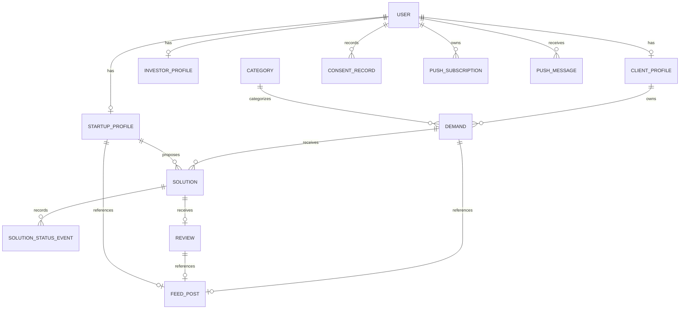

# StarUP: arquitetura do MVP

## Fases 1 e 2: decisões consolidadas

- Uma conta tem um papel imutável pela API: CLIENT, STARTUP ou INVESTOR.
- O campo físico existente é usuarios.Usuario.perfil_ativo. common.roles define o vocabulário inglês da API, sem substituir AUTH_USER_MODEL.
- Uma pessoa/empresa que precise atuar em vários papéis e equipes exigirá organizações e memberships; não introduzidos sem necessidade.
- Investidor é cliente da vitrine, com leitura privada, sem publicar demandas, propostas ou avaliações. Coletamos apenas e-mail e senha; não exigimos CPF/CNPJ nesse modo, por minimização.
- Cliente PF/PJ publica demanda. Uma startup aceita por demanda; uma proposta por startup/demanda.
- Avaliação imutável, inteira, de 1 a 5, feita pelo proprietário após entrega; avaliar confirma conclusão.
- Demanda privada é acessível ao dono e à startup já aceita. Para receber propostas, uma demanda nova precisa ser pública. Convites privados estão fora do MVP.
- Feed público também sem login. Propostas, entregas e dados de identidade são privados.
- Django 5.2, Python >=3.12, PostgreSQL, sessão Django na mesma origem e Redis compartilhado.

## Apps e ER

Accounts contém a API e os serviços de autenticação; usuarios mantém a identidade e as tabelas legadas. Dados civis existentes continuam privados no usuário para evitar migração destrutiva. Profiles contém apenas os dados específicos de cada papel.

O investidor não recebe ClientProfile porque não transaciona no MVP. Evitamos coletar documentos sem finalidade. Sua identidade pertence exclusivamente à autenticação e ao InvestorProfile privado.

## Integridade e transações

Serviços autorizam o ator atual no banco e bloqueiam seu usuário, a demanda e a solução, nessa ordem. Aceitar rejeita as propostas concorrentes e registra histórico. Avaliar grava Review, conclui demanda e solução e publica FeedPost na mesma transação. Não há signals de negócio.

Banco garante documento canônico único, e-mail único sem diferença de caixa, proposta única por startup/demanda, uma solução aceita por demanda, nota de 1 a 5 e um destino tipado por post. Regras entre tabelas são aplicadas nos serviços. Clientes de banco não devem gravar fora desses serviços.

Documentos: CPF com 11 dígitos; CNPJ numérico ou alfanumérico com 14 posições, usando algoritmo da Receita Federal (valor ASCII menos 48). Normalização remove só separadores permitidos. Documentos nunca são publicados; validar dígitos não verifica titularidade.

Review não recebe autor: proprietário deriva de solution.demand.client. Não há comentários públicos livres em avaliações nesse incremento. Média e quantidade usam agregação em lote, sem contador desnormalizado.

## Feed e desempenho

FeedPost usa três OneToOneFields opcionais e CheckConstraint que exige exatamente um destino coerente com kind. GenericForeignKey foi descartado por ausência de FK real ao alvo. Tabelas específicas não agregariam atributos agora e exigiriam mais joins e controle de exclusividade.

position é BigAutoField interno, usado pela paginação CursorPagination; id público é UUIDv4. O cursor é codificação de posição, não segredo criptográfico. Nenhuma posição pertence a um investidor. Ordem não pode ser controlada por parâmetros públicos.

Selectors consultam projeções values() com campos enumerados. Hidratação do feed usa uma consulta por tipo presente na página, nunca por post. Conteúdo privado não entra no feed. Média e contagem consideram avaliações válidas da startup; avaliações de trabalhos privados contribuem somente como agregados, sem expor demanda ou autor.

## Privacidade do investidor

Alias aleatório de 96 bits é privado e não deriva de nome, documento, e-mail ou ID de autenticação. Não há diretório de investidores, telemetria de visitantes, favoritos públicos, filtros por identidade, presença ou revelação voluntária.

A plataforma consegue autenticar a pessoa: é pseudonimização/isolamento perante participantes, não anonimização jurídica irreversível. A autenticação permanece tratamento de dados pessoais. Operadores privilegiados são distintos dos participantes; somente superusuários internos podem consultar identidades no admin. Nenhum usuário comum ou staff sem esse privilégio acessa cadastros.

Serializers públicos nunca incluem usuário, documento ou perfil de investidor. Querysets públicos não selecionam esses campos, mesmo em relações. Rotas legadas da API e do CRUD HTML foram retiradas da configuração pública. Admin de identidade é somente leitura, restrito a superusuários.

Registration retorna o mesmo HTTP 202 e corpo para identidade duplicada; login tem erro genérico e caminho de hash para conta inexistente. Isso reduz enumeração por conteúdo, mas não garante indistinguibilidade temporal de cadastro. Login/cadastro têm limites compartilhados por IP, além de throttles DRF. Borda deve controlar abuso distribuído. REMOTE_ADDR deve ser fornecido por proxy confiável; não usamos X-Forwarded-For arbitrário.

Não registrar bodies, documentos, e-mail, cookies, tokens, aliases ou endpoints push. __str__ do usuário não inclui dados civis. Auditoria de acesso administrativo e retenção operacional ainda devem ser implantadas antes de produção.

## PWA e autenticação

Sessão com cookie HttpOnly, Secure fora de DEBUG, SameSite=Lax, expiração de um dia. Escritas, inclusive login/cadastro, exigem CSRF. Sem tokens no localStorage. Frontend e API têm a mesma origem.

Service worker usa cache-first para shell versionado; stale-while-revalidate para feed exclusivamente público e sem credenciais, no máximo 10 páginas e 24 horas. Recursos privados usam rede e no-store; não há fila offline de escritas. Logout limpa caches de dados. Atualização de worker requer ação explícita para não perder formulários.

Conteúdo público baixado não pode ser revogado em dispositivo offline. A interface indica offline. Ao reconectar, o feed é revalidado. Não publicar dados sensíveis esperando revogação retroativa.

Push requer consentimento e chave VAPID externa. Subscriptions privadas, URLs HTTPS com allowlist exata de serviços para evitar SSRF, payload genérico, acesso aos detalhes após autenticação. Outbox durável é confirmada junto da transação; comando send_pending_push entrega, com timeout, remoção de endpoints expirados e até três tentativas. Entrega é pelo menos uma vez; navegador agrupa pelo mesmo tag. Agendar o comando na infraestrutura do deploy, sem adicionar Celery no MVP.

## LGPD e exclusão

Policy acknowledgement é versionado, separado do consentimento opcional de push. Base legal, controlador, operadores e prazos precisam de definição operacional; aceite de política não substitui essa análise.

DELETE /api/v1/me/ remove nome, telefone, documento, perfis privados de investidor, consents e subscriptions; torna e-mail não identificável e senha inutilizável; desativa acesso em todas as sessões. Sanitiza texto de demandas/propostas/entregas relacionadas e retira demandas do feed. Conserva UUIDs internos, vínculos e notas mínimos: esses registros não devem ser declarados juridicamente anônimos sem análise de reidentificação.

Exclusão definitiva de registros e purga de backups dependem da política de retenção. Restauração deve reaplicar pedidos de exclusão. Não há promessa de conformidade legal completa apenas pelo código.

## Migrações e dados existentes

0001_initial de usuarios foi preservada. Novos apps criam tabelas próprias. profiles.0002 copia perfis legados de papéis compatíveis sem apagar originais; perfis não compatíveis não recebem exposição pública. CNPJ inválido/duplicado e e-mail duplicado sem diferença de caixa interrompem atomicamente a migração com mensagem sem PII.

Tabelas legadas ficam fora das rotas e do admin; servem à transição e exigem acompanhamento de retenção. Exclusão também sanitiza essas tabelas. Imports são reversíveis antes de novos vínculos; rollback após uso requer backup e plano de dados, pois desmontar schema remove os registros novos. Não converter SQLite de produção automaticamente: exportar/importar com validação em staging e backup.

## Revisão crítica e limites

- Verificação de e-mail, recuperação de senha, MFA de operadores e moderação de conteúdo são próximos requisitos antes de lançamento público.
- Avaliações exigem vínculo e entrega válida, mas isso não impede contas combinadas ou trabalhos fictícios. Moderação e mecanismos de contestação são necessários conforme o uso real.
- Documento não é criptografado pela aplicação neste incremento; usar criptografia de disco/banco/backups, acesso mínimo e avaliar cifragem de campo com gestão de chaves.
- Sem pagamentos, chat, anexos, auditorias, editais, eventos, convites privados ou equipes.
- Alterações de proposta e conclusão sem nota não são suportadas no MVP; uma entrega aguardando avaliação fica DELIVERED.
- Exclusão durante trabalho em andamento pode exigir encerramento operacional manual do contrato; não há contrato financeiro neste incremento.
- Consentimentos e outbox têm retenção operacional ainda a definir; rotina de limpeza é necessária.
- Configuração do proxy/TLS, limites na borda e política LGPD são obrigações de deploy, não inferidas como concluídas.
