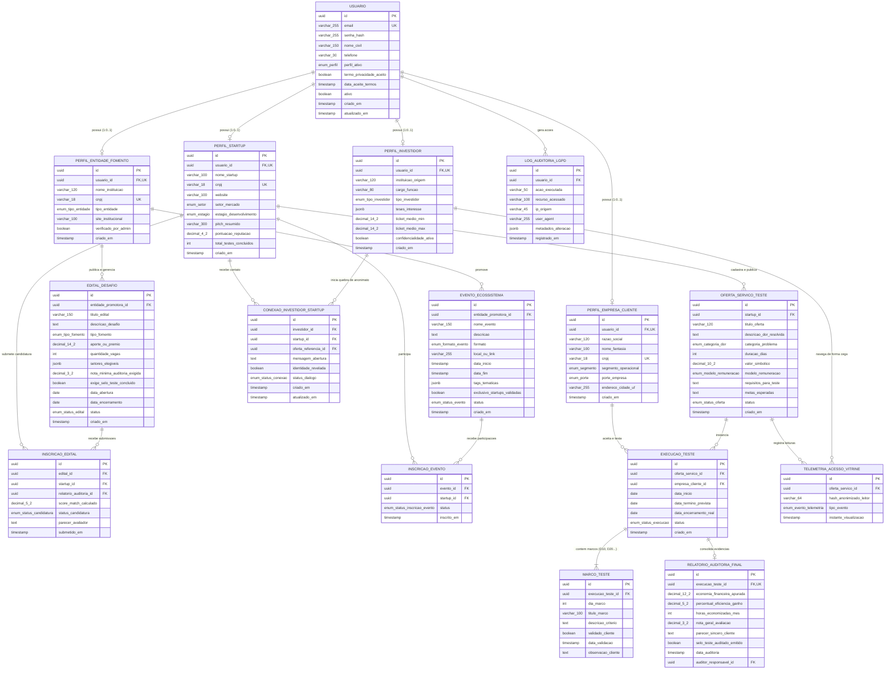
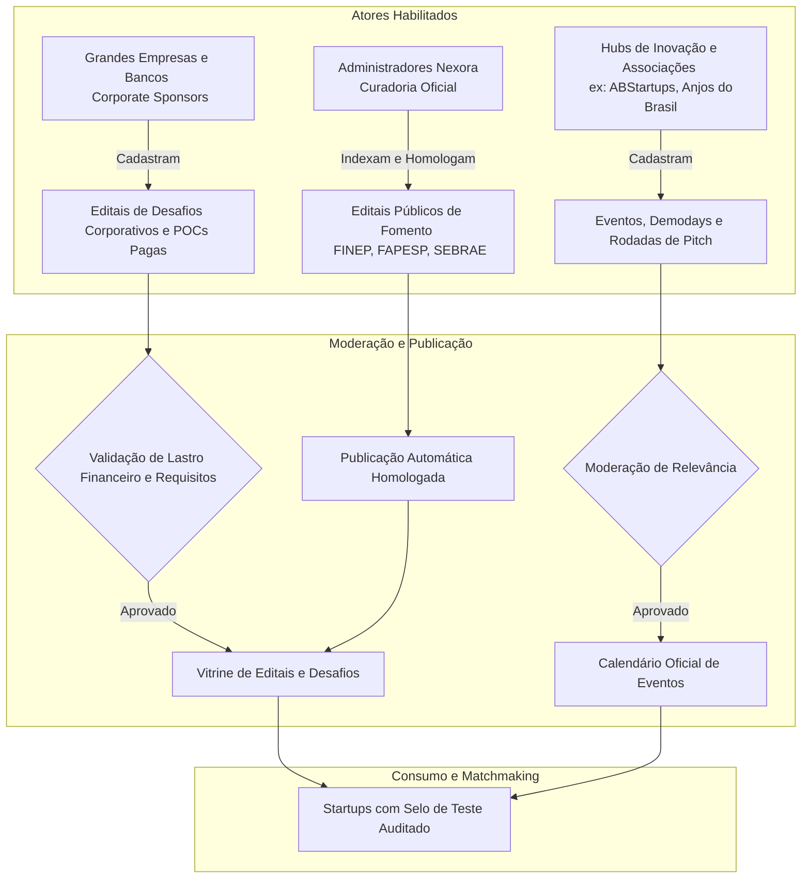
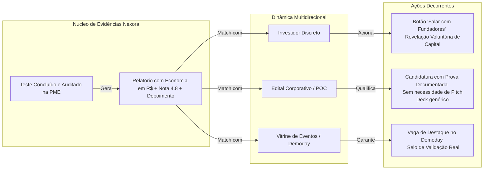

# NEXORA: Engenharia de Dados, Governança LGPD e Estratégia de Matchmaking Baseado em Testes Reais

---

## 1. Visão Geral e Contextualização do Sistema

A **Nexora** é uma plataforma concebida para superar a barreira da desconfiança de mercado (*teatro da inovação* e falha de *product-market fit*) enfrentada por startups emergentes. Em vez de avaliar startups por apresentações de slides (*pitch decks*) ou métricas autodeclaradas, a Nexora ancora a reputação das soluções em **testes práticos de curta duração (30 a 45 dias)** executados no cotidiano de Pequenas e Médias Empresas (PMEs). 

O ciclo gera **métricas auditadas** (economia financeira em R$, horas poupadas, notas de desempenho e depoimentos reais), conferindo à startup um **Selo de Validação de Mercado**. 

A partir deste núcleo de evidências, a plataforma opera uma dinâmica multidirecional de matchmaking entre:
1. **Startups Tecnológicas**: Provedoras de soluções que buscam validação real e tração.
2. **Empresas Clientes (PMEs / Testadoras)**: Negócios com dores operacionais diárias em busca de tecnologia acessível sem risco de contratos vultosos.
3. **Investidores de Risco / Avaliadores Ocultos**: Usuários que analisam números validados de forma anônima e discreta.
4. **Editais e Desafios Corporativos**: Chamadas públicas e privadas que buscam startups qualificadas com provas de tração real.
5. **Eventos do Ecossistema**: Demodays, rodadas de conexão e fóruns de inovação aberta.

---

## 2. Diagrama de Entidades e Relacionamentos (ERD)

Abaixo é apresentado o modelo relacional completo que suporta os fluxos operacionais, o módulo de telemetria cega para investidores, o ciclo de vida dos testes auditados e a integração com editais e eventos.

---

## 3. Dicionário de Dados e Mapeamento de Atributos

### 3.1. Tabela: `USUARIO`
Armazena a identidade canônica de acesso ao sistema (autenticação centralizada e controle LGPD).

| Atributo | Tipo de Dado | Obrigatório? | Restrição / Default | Descrição Funcional |
| :--- | :--- | :--- | :--- | :--- |
| `id` | `UUID` | **Sim** | `PRIMARY KEY, DEFAULT gen_random_uuid()` | Identificador universal único do usuário. |
| `email` | `VARCHAR(255)` | **Sim** | `UNIQUE, NOT NULL` | E-mail corporativo ou institucional. |
| `senha_hash` | `VARCHAR(255)` | **Sim** | `NOT NULL` | Hash criptográfico (Argon2id ou Bcrypt salt 12). |
| `nome_civil` | `VARCHAR(150)` | **Sim** | `NOT NULL` | Nome legal completo do titular. |
| `telefone` | `VARCHAR(30)` | Não | `NULL` | Contato direto (WhatsApp/telefone). |
| `perfil_ativo` | `ENUM` | **Sim** | `NOT NULL` | `('STARTUP', 'EMPRESA_CLIENTE', 'INVESTIDOR', 'ENTIDADE_FOMENTO', 'ADMIN')`. |
| `termo_privacidade_aceito` | `BOOLEAN` | **Sim** | `DEFAULT FALSE, NOT NULL` | Aceite expresso da Política de Privacidade e Termos de Uso. |
| `data_aceite_termos` | `TIMESTAMP` | **Sim** | `DEFAULT CURRENT_TIMESTAMP` | Carimbo de data/hora do consentimento LGPD. |
| `ativo` | `BOOLEAN` | **Sim** | `DEFAULT TRUE` | Flag de ativação da conta. |
| `criado_em` | `TIMESTAMP` | **Sim** | `DEFAULT CURRENT_TIMESTAMP` | Data de criação da conta. |
| `atualizado_em` | `TIMESTAMP` | **Sim** | `DEFAULT CURRENT_TIMESTAMP` | Data de atualização do registro. |

---

### 3.2. Tabela: `PERFIL_STARTUP`
Dados específicos da empresa desenvolvedora de tecnologia.

| Atributo | Tipo de Dado | Obrigatório? | Restrição / Default | Descrição Funcional |
| :--- | :--- | :--- | :--- | :--- |
| `id` | `UUID` | **Sim** | `PRIMARY KEY` | Identificador único do perfil da startup. |
| `usuario_id` | `UUID` | **Sim** | `FK -> USUARIO(id), UNIQUE` | Vínculo com a conta de usuário administradora. |
| `nome_startup` | `VARCHAR(100)` | **Sim** | `NOT NULL` | Nome de mercado / Marca da startup. |
| `cnpj` | `VARCHAR(18)` | Não | `UNIQUE, NULL` | CNPJ da startup (opcional em estágio inicial/ideação). |
| `website` | `VARCHAR(100)` | Não | `NULL` | URL oficial do produto/empresa. |
| `setor_mercado` | `ENUM` | **Sim** | `NOT NULL` | `('LOGISTICA', 'FINANCAS', 'VAREJO', 'SAUDE', 'AGRO', 'EDUCACAO', 'SERVICOS', 'OUTROS')`. |
| `estagio_desenvolvimento`| `ENUM` | **Sim** | `NOT NULL` | `('PROTOTIPO', 'MVP', 'TRAÇÃO_INICIAL', 'ESCALA')`. |
| `pitch_resumido` | `VARCHAR(300)` | **Sim** | `NOT NULL` | Descrição sucinta da proposta de valor (máx. 300 caracteres). |
| `pontuacao_reputacao` | `DECIMAL(4,2)` | **Sim** | `DEFAULT 0.00` | Reputação ponderada calculada a partir de testes concluídos. |
| `total_testes_concluidos`| `INT` | **Sim** | `DEFAULT 0` | Contador auditado de testes encerrados com sucesso. |
| `criado_em` | `TIMESTAMP` | **Sim** | `DEFAULT CURRENT_TIMESTAMP` | Data de cadastro do perfil. |

---

### 3.3. Tabela: `PERFIL_EMPRESA_CLIENTE`
Dados da PME que busca resolver gargalos operacionais testando soluções.

| Atributo | Tipo de Dado | Obrigatório? | Restrição / Default | Descrição Funcional |
| :--- | :--- | :--- | :--- | :--- |
| `id` | `UUID` | **Sim** | `PRIMARY KEY` | Identificador do perfil cliente testador. |
| `usuario_id` | `UUID` | **Sim** | `FK -> USUARIO(id), UNIQUE` | Vínculo com a conta do gestor responsável. |
| `razao_social` | `VARCHAR(120)` | **Sim** | `NOT NULL` | Razão social registrada na Receita Federal. |
| `nome_fantasia` | `VARCHAR(100)` | **Sim** | `NOT NULL` | Nome público do estabelecimento comercial/industrial. |
| `cnpj` | `VARCHAR(18)` | **Sim** | `UNIQUE, NOT NULL` | CNPJ ativo da empresa contratante do teste. |
| `segmento_operacional` | `ENUM` | **Sim** | `NOT NULL` | `('OFICINA_MECANICA', 'MERCADO_VAREJO', 'DISTRIBUIDORA', 'RESTAURANTE', 'CLINICA', 'LOGISTICA_LOCAL', 'OUTROS')`. |
| `porte_empresa` | `ENUM` | **Sim** | `NOT NULL` | `('MEI', 'ME', 'EPP', 'MEDIO_PORTE')`. |
| `endereco_cidade_uf` | `VARCHAR(255)` | **Sim** | `NOT NULL` | Cidade e Estado de operação (relevante para match local). |
| `criado_em` | `TIMESTAMP` | **Sim** | `DEFAULT CURRENT_TIMESTAMP` | Data de inclusão. |

---

### 3.4. Tabela: `PERFIL_INVESTIDOR`
Armazena as preferências de investimento com estrito isolamento de visibilidade na vitrine.

| Atributo | Tipo de Dado | Obrigatório? | Restrição / Default | Descrição Funcional |
| :--- | :--- | :--- | :--- | :--- |
| `id` | `UUID` | **Sim** | `PRIMARY KEY` | Identificador único do investidor. |
| `usuario_id` | `UUID` | **Sim** | `FK -> USUARIO(id), UNIQUE` | Vínculo com a conta canônica. |
| `instituicao_origem` | `VARCHAR(120)` | Não | `NULL` | Fundo de Venture Capital, Family Office ou Anjo Autônomo. |
| `cargo_funcao` | `VARCHAR(80)` | Não | `NULL` | Cargo institucional (ex.: Partner, Scout, Angel Investor). |
| `tipo_investidor` | `ENUM` | **Sim** | `NOT NULL` | `('ANJO', 'PRE_SEED', 'SEED', 'VENTURE_CAPITAL', 'CORPORATE_VC')`. |
| `teses_interesse` | `JSONB` | **Sim** | `DEFAULT '[]'::jsonb` | Tags de interesse (ex.: `["logistica", "b2b", "ia_aplicada"]`). |
| `ticket_medio_min` | `DECIMAL(14,2)`| Não | `NULL` | Faixa mínima de cheque pretendido. |
| `ticket_medio_max` | `DECIMAL(14,2)`| Não | `NULL` | Faixa máxima de cheque pretendido. |
| `confidencialidade_ativa`| `BOOLEAN` | **Sim** | `DEFAULT TRUE` | Se `TRUE`, nenhum dado além do primeiro nome é visível. |
| `criado_em` | `TIMESTAMP` | **Sim** | `DEFAULT CURRENT_TIMESTAMP` | Data do cadastro. |

---

### 3.5. Tabela: `PERFIL_ENTIDADE_FOMENTO`
Entidades responsáveis pelo lançamento e gestão de editais, premiações e eventos.

| Atributo | Tipo de Dado | Obrigatório? | Restrição / Default | Descrição Funcional |
| :--- | :--- | :--- | :--- | :--- |
| `id` | `UUID` | **Sim** | `PRIMARY KEY` | Identificador único da entidade patrocinadora. |
| `usuario_id` | `UUID` | **Sim** | `FK -> USUARIO(id), UNIQUE` | Gestor institucional credenciado. |
| `nome_instituicao` | `VARCHAR(120)` | **Sim** | `NOT NULL` | Nome corporativo (ex.: Banco Alfa, Grande Indústria, SEBRAE). |
| `cnpj` | `VARCHAR(18)` | **Sim** | `UNIQUE, NOT NULL` | CNPJ da instituição promotora. |
| `tipo_entidade` | `ENUM` | **Sim** | `NOT NULL` | `('GRANDE_EMPRESA', 'HUB_INOVACAO', 'ACELERADORA', 'ORGAO_GOVERNO', 'ASSOCIACAO_SETORIAL')`. |
| `site_institucional` | `VARCHAR(100)` | Não | `NULL` | Portal de transparência ou corporativo. |
| `verificado_por_admin` | `BOOLEAN` | **Sim** | `DEFAULT FALSE` | Moderação da plataforma para habilitar publicação de editais. |
| `criado_em` | `TIMESTAMP` | **Sim** | `DEFAULT CURRENT_TIMESTAMP` | Data de credenciamento. |

---

### 3.6. Tabela: `OFERTA_SERVICO_TESTE`
A proposta prática de 30 a 45 dias disponibilizada na vitrine pública.

| Atributo | Tipo de Dado | Obrigatório? | Restrição / Default | Descrição Funcional |
| :--- | :--- | :--- | :--- | :--- |
| `id` | `UUID` | **Sim** | `PRIMARY KEY` | Identificador da oferta de teste. |
| `startup_id` | `UUID` | **Sim** | `FK -> PERFIL_STARTUP(id)` | Startup titular do produto em teste. |
| `titulo_oferta` | `VARCHAR(120)` | **Sim** | `NOT NULL` | Título atrativo (ex.: *Otimizador de Rotas com Redução de Combustível*). |
| `descricao_dor_resolvida`| `TEXT` | **Sim** | `NOT NULL` | Qual problema específico da rotina diária é sanado. |
| `categoria_problema` | `ENUM` | **Sim** | `NOT NULL` | `('LOGISTICA_ENTREGAS', 'CONTROLE_ESTOQUE', 'GESTAO_FINANCEIRA', 'VENDAS_ATENDIMENTO', 'REDUCAO_DESPERDICIO')`. |
| `duracao_dias` | `INT` | **Sim** | `CHECK (duracao_dias IN (30, 45))` | Período de execução prática acordado (30 ou 45 dias). |
| `valor_simbolico` | `DECIMAL(10,2)`| **Sim** | `DEFAULT 0.00` | Taxa de cobertura de custos ou R$ 0,00. |
| `modelo_remuneracao` | `ENUM` | **Sim** | `NOT NULL` | `('TAXA_SIMBOLICA_FIXA', 'COMISSAO_ECONOMIA_APURADA', 'GRATUITO_VALIDACAO')`. |
| `requisitos_para_teste` | `TEXT` | **Sim** | `NOT NULL` | O que a PME precisa ter (ex.: computador com internet, frota de 2 veículos). |
| `metas_esperadas` | `TEXT` | **Sim** | `NOT NULL` | Metas de validação (ex.: diminuir 15% do custo de combustível). |
| `status` | `ENUM` | **Sim** | `DEFAULT 'DISPONIVEL'` | `('DISPONIVEL', 'EM_TESTE', 'ENCERRADO', 'PAUSADO')`. |
| `criado_em` | `TIMESTAMP` | **Sim** | `DEFAULT CURRENT_TIMESTAMP` | Data de publicação. |

---

### 3.7. Tabela: `EXECUCAO_TESTE`
A contratação e execução prática entre a PME e a Startup.

| Atributo | Tipo de Dado | Obrigatório? | Restrição / Default | Descrição Funcional |
| :--- | :--- | :--- | :--- | :--- |
| `id` | `UUID` | **Sim** | `PRIMARY KEY` | Identificador da rotina de teste em andamento. |
| `oferta_servico_id` | `UUID` | **Sim** | `FK -> OFERTA_SERVICO_TESTE(id)` | Oferta de teste acionada no aceite com 1 clique. |
| `empresa_cliente_id` | `UUID` | **Sim** | `FK -> PERFIL_EMPRESA_CLIENTE(id)` | Empresa que aceitou testar na rotina real. |
| `data_inicio` | `DATE` | **Sim** | `DEFAULT CURRENT_DATE` | Início do uso no terreno operacional. |
| `data_termino_prevista` | `DATE` | **Sim** | `NOT NULL` | Início + 30 ou 45 dias. |
| `data_encerramento_real`| `DATE` | Não | `NULL` | Data de conclusão efetiva do teste. |
| `status` | `ENUM` | **Sim** | `DEFAULT 'EM_ANDAMENTO'` | `('EM_ANDAMENTO', 'CONCLUIDO_PENDENTE_RELATORIO', 'VALIDADO_AUDITADO', 'CANCELADO')`. |
| `criado_em` | `TIMESTAMP` | **Sim** | `DEFAULT CURRENT_TIMESTAMP` | Carimbo de contratação. |

---

### 3.8. Tabela: `MARCO_TESTE`
Pontos de controle contínuos durante o teste operacional (Checkpoints de Validação).

| Atributo | Tipo de Dado | Obrigatório? | Restrição / Default | Descrição Funcional |
| :--- | :--- | :--- | :--- | :--- |
| `id` | `UUID` | **Sim** | `PRIMARY KEY` | Identificador do marco. |
| `execucao_teste_id` | `UUID` | **Sim** | `FK -> EXECUCAO_TESTE(id)` | Teste vinculado. |
| `dia_marco` | `INT` | **Sim** | `NOT NULL` | Dia relativo (ex.: Dia 10 = Integração; Dia 20 = Estabilidade). |
| `titulo_marco` | `VARCHAR(100)` | **Sim** | `NOT NULL` | Nome do marco intermediário. |
| `descricao_criterio` | `TEXT` | **Sim** | `NOT NULL` | Condição de sucesso para validação do marco. |
| `validado_cliente` | `BOOLEAN` | **Sim** | `DEFAULT FALSE` | Confirmação de aceite feita pela PME com um clique. |
| `data_validacao` | `TIMESTAMP` | Não | `NULL` | Momento exato em que a PME validou o marco. |
| `observacao_cliente` | `TEXT` | Não | `NULL` | Notas operacionais registradas pela empresa testadora. |

---

### 3.9. Tabela: `RELATORIO_AUDITORIA_FINAL`
Consolidação das métricas finais geradas pela PME com chancela de auditoria.

| Atributo | Tipo de Dado | Obrigatório? | Restrição / Default | Descrição Funcional |
| :--- | :--- | :--- | :--- | :--- |
| `id` | `UUID` | **Sim** | `PRIMARY KEY` | Identificador do relatório auditado. |
| `execucao_teste_id` | `UUID` | **Sim** | `FK -> EXECUCAO_TESTE(id), UNIQUE` | Vínculo 1:1 com o teste concluído. |
| `economia_financeira_apurada`| `DECIMAL(12,2)`| **Sim** | `NOT NULL` | Valor líquido economizado em Reais (R$) no período. |
| `percentual_eficiencia_ganho`| `DECIMAL(5,2)` | Não | `NULL` | Ganho de produtividade (%) medido na rotina. |
| `horas_economizadas_mes`| `INT` | Não | `NULL` | Total de horas de mão de obra poupadas. |
| `nota_geral_avaliacao` | `DECIMAL(3,2)` | **Sim** | `CHECK (nota_geral_avaliacao BETWEEN 1 AND 5)` | Nota sincera concedida pela PME (1.00 a 5.00). |
| `depoimento_sincero_cliente` | `TEXT` | **Sim** | `NOT NULL` | Parecer oficial assinado pelo gestor da empresa cliente. |
| `selo_teste_auditado_emitido`| `BOOLEAN` | **Sim** | `DEFAULT TRUE` | Habilita a insígnia *"Teste Concluído e Auditado"*. |
| `data_auditoria` | `TIMESTAMP` | **Sim** | `DEFAULT CURRENT_TIMESTAMP` | Data da consolidação dos dados. |
| `auditor_responsavel_id`| `UUID` | Não | `FK -> USUARIO(id), NULL` | ID do membro da equipe técnica que auditou (ex.: CTO/Backend). |

---

### 3.10. Tabela: `TELEMETRIA_ACESSO_VITRINE`
Telemetria cega/neutra para registrar o interesse do mercado sem quebrar a privacidade do investidor.

| Atributo | Tipo de Dado | Obrigatório? | Restrição / Default | Descrição Funcional |
| :--- | :--- | :--- | :--- | :--- |
| `id` | `UUID` | **Sim** | `PRIMARY KEY` | Identificador do evento de telemetria. |
| `oferta_servico_id` | `UUID` | **Sim** | `FK -> OFERTA_SERVICO_TESTE(id)` | Oferta visualizada. |
| `hash_anonimizado_leitor`| `VARCHAR(64)` | **Sim** | `NOT NULL` | Hash SHA-256 unidirecional gerado via `SHA256(usuario_id + salt_secreto_diario)`. |
| `tipo_evento` | `ENUM` | **Sim** | `NOT NULL` | `('VISUALIZACAO_QUALIFICADA', 'LEITURA_METRICAS_AUDITADAS', 'DOWNLOAD_RELATORIO')`. |
| `instante_visualizacao`| `TIMESTAMP` | **Sim** | `DEFAULT CURRENT_TIMESTAMP` | Momento da leitura (agrupado em métricas de dashboard). |

---

### 3.11. Tabela: `CONEXAO_INVESTIDOR_STARTUP`
A quebra voluntária do anonimato via botão unilateral *[Falar com os Fundadores]*.

| Atributo | Tipo de Dado | Obrigatório? | Restrição / Default | Descrição Funcional |
| :--- | :--- | :--- | :--- | :--- |
| `id` | `UUID` | **Sim** | `PRIMARY KEY` | Identificador do canal de diálogo direto. |
| `investidor_id` | `UUID` | **Sim** | `FK -> PERFIL_INVESTIDOR(id)` | Investidor que acionou o contato voluntariamente. |
| `startup_id` | `UUID` | **Sim** | `FK -> PERFIL_STARTUP(id)` | Startup destinatária da abordagem. |
| `oferta_referencia_id` | `UUID` | **Sim** | `FK -> OFERTA_SERVICO_TESTE(id)` | Caso validado que motivou a conexão. |
| `mensagem_abertura` | `TEXT` | **Sim** | `NOT NULL` | Mensagem inicial do investidor apresentando seu interesse. |
| `identidade_revelada` | `BOOLEAN` | **Sim** | `DEFAULT TRUE` | Confirmação de que o investidor autorizou exibir nome corporativo e fundo. |
| `status_dialogo` | `ENUM` | **Sim** | `DEFAULT 'SOLICITADO'` | `('SOLICITADO', 'EM_CONVERSA', 'DECLINADO', 'ENCERRADO')`. |
| `criado_em` | `TIMESTAMP` | **Sim** | `DEFAULT CURRENT_TIMESTAMP` | Data de abertura do contato. |
| `atualizado_em` | `TIMESTAMP` | **Sim** | `DEFAULT CURRENT_TIMESTAMP` | Data de atualização do status. |

---

### 3.12. Tabela: `EDITAL_DESAFIO`
Editais públicos de fomento ou desafios de inovação aberta corporativa.

| Atributo | Tipo de Dado | Obrigatório? | Restrição / Default | Descrição Funcional |
| :--- | :--- | :--- | :--- | :--- |
| `id` | `UUID` | **Sim** | `PRIMARY KEY` | Identificador único do edital ou desafio. |
| `entidade_promotora_id`| `UUID` | **Sim** | `FK -> PERFIL_ENTIDADE_FOMENTO(id)`| Corporação, hub ou órgão que lançou o edital. |
| `titulo_edital` | `VARCHAR(150)` | **Sim** | `NOT NULL` | Título da chamada (ex.: *Edital Aberto de Eficiência Logística 2026*). |
| `descricao_desafio` | `TEXT` | **Sim** | `NOT NULL` | Problema corporativo a ser solucionado ou escopo do fomento. |
| `tipo_fomento` | `ENUM` | **Sim** | `NOT NULL` | `('DESAFIO_CORPORATIVO_PAGO', 'CONTRATACAO_PILOTO_POC', 'SUBSIDIO_NAO_REEMBOLSAVEL', 'APORTE_EQUITY')`. |
| `aporte_ou_premio` | `DECIMAL(14,2)`| Não | `DEFAULT 0.00` | Valor financeiro alocado para o edital/piloto (R$). |
| `quantidade_vagas` | `INT` | **Sim** | `DEFAULT 1` | Quantidade de startups a serem selecionadas. |
| `setores_elegiveis` | `JSONB` | **Sim** | `DEFAULT '[]'::jsonb` | Lista de setores aceitos (ex.: `["LOGISTICA", "VAREJO"]`). |
| `nota_minima_auditoria_exigida`| `DECIMAL(3,2)` | Não | `DEFAULT 3.50` | Nota mínima do teste auditado na Nexora para qualificação. |
| `exige_selo_teste_concluido` | `BOOLEAN` | **Sim** | `DEFAULT TRUE` | Filtro eliminatório de validação prática no terreno real. |
| `data_abertura` | `DATE` | **Sim** | `NOT NULL` | Início das inscrições. |
| `data_encerramento` | `DATE` | **Sim** | `NOT NULL` | Fim das inscrições. |
| `status` | `ENUM` | **Sim** | `DEFAULT 'ABERTO'` | `('RASCUNHO', 'ABERTO', 'EM_AVALIACAO', 'ENCERRADO')`. |
| `criado_em` | `TIMESTAMP` | **Sim** | `DEFAULT CURRENT_TIMESTAMP` | Data de publicação. |

---

### 3.13. Tabela: `INSCRICAO_EDITAL`
Candidatura de uma startup validada a um edital ou desafio.

| Atributo | Tipo de Dado | Obrigatório? | Restrição / Default | Descrição Funcional |
| :--- | :--- | :--- | :--- | :--- |
| `id` | `UUID` | **Sim** | `PRIMARY KEY` | Identificador da candidatura. |
| `edital_id` | `UUID` | **Sim** | `FK -> EDITAL_DESAFIO(id)` | Edital pretendido. |
| `startup_id` | `UUID` | **Sim** | `FK -> PERFIL_STARTUP(id)` | Startup candidata. |
| `relatorio_auditoria_id`| `UUID` | **Sim** | `FK -> RELATORIO_AUDITORIA_FINAL(id)`| Prova documental vinculada (Métricas Reais auditadas na Nexora). |
| `score_match_calculado`| `DECIMAL(5,2)` | **Sim** | `NOT NULL` | Pontuação algorítmica de aderência (0 a 100). |
| `status_candidatura` | `ENUM` | **Sim** | `DEFAULT 'SUBMETIDA'` | `('SUBMETIDA', 'PRE_SELECIONADA', 'APROVADA_PILOTO', 'REJEITADA')`. |
| `parecer_avaliador` | `TEXT` | Não | `NULL` | Feedback estruturado emitido pela comissão do edital. |
| `submetido_em` | `TIMESTAMP` | **Sim** | `DEFAULT CURRENT_TIMESTAMP` | Momento do envio da candidatura. |

---

### 3.14. Tabela: `EVENTO_ECOSSISTEMA`
Feiras, demodays, rodadas de investimento e workshops.

| Atributo | Tipo de Dado | Obrigatório? | Restrição / Default | Descrição Funcional |
| :--- | :--- | :--- | :--- | :--- |
| `id` | `UUID` | **Sim** | `PRIMARY KEY` | Identificador do evento. |
| `entidade_promotora_id`| `UUID` | **Sim** | `FK -> PERFIL_ENTIDADE_FOMENTO(id)`| Entidade organizadora ou Admin. |
| `nome_evento` | `VARCHAR(150)` | **Sim** | `NOT NULL` | Nome oficial do evento (ex.: *Demoday Nexora Batch #1*). |
| `descricao` | `TEXT` | **Sim** | `NOT NULL` | Objetivo e agenda do evento. |
| `formato` | `ENUM` | **Sim** | `NOT NULL` | `('ONLINE', 'PRESENCIAL', 'HIBRIDO')`. |
| `local_ou_link` | `VARCHAR(255)` | **Sim** | `NOT NULL` | Endereço físico ou link do broadcast de transmissão. |
| `data_inicio` | `TIMESTAMP` | **Sim** | `NOT NULL` | Horário de abertura. |
| `data_fim` | `TIMESTAMP` | **Sim** | `NOT NULL` | Horário de término. |
| `tags_tematicas` | `JSONB` | **Sim** | `DEFAULT '[]'::jsonb` | Tags de categorização (ex.: `["pitch", "logistica", "seed"]`). |
| `exclusivo_startups_validadas` | `BOOLEAN` | **Sim** | `DEFAULT FALSE` | Permite participação apenas de soluções com selo auditado. |
| `status` | `ENUM` | **Sim** | `DEFAULT 'AGENDADO'` | `('AGENDADO', 'AO_VIVO', 'CONCLUIDO', 'CANCELADO')`. |
| `criado_em` | `TIMESTAMP` | **Sim** | `DEFAULT CURRENT_TIMESTAMP` | Data de criação. |

---

### 3.15. Tabela: `INSCRICAO_EVENTO`
Vínculo de participação das startups nos eventos.

| Atributo | Tipo de Dado | Obrigatório? | Restrição / Default | Descrição Funcional |
| :--- | :--- | :--- | :--- | :--- |
| `id` | `UUID` | **Sim** | `PRIMARY KEY` | Identificador da inscrição no evento. |
| `evento_id` | `UUID` | **Sim** | `FK -> EVENTO_ECOSSISTEMA(id)` | Evento correspondente. |
| `startup_id` | `UUID` | **Sim** | `FK -> PERFIL_STARTUP(id)` | Startup participante. |
| `status` | `ENUM` | **Sim** | `DEFAULT 'CONFIRMADA'` | `('CONFIRMADA', 'EM_LISTA_ESPERA', 'CANCELADA')`. |
| `inscrito_em` | `TIMESTAMP` | **Sim** | `DEFAULT CURRENT_TIMESTAMP` | Horário da inscrição. |

---

### 3.16. Tabela: `LOG_AUDITORIA_LGPD`
Trilha de auditoria indelével de acesso e conformidade (Art. 37 da LGPD).

| Atributo | Tipo de Dado | Obrigatório? | Restrição / Default | Descrição Funcional |
| :--- | :--- | :--- | :--- | :--- |
| `id` | `UUID` | **Sim** | `PRIMARY KEY` | Identificador do log. |
| `usuario_id` | `UUID` | Não | `FK -> USUARIO(id), NULL` | Titular que executou a operação (ou NULL para requisição deslogada). |
| `acao_executada` | `VARCHAR(50)` | **Sim** | `NOT NULL` | Ex.: `('LOGIN', 'REVELACAO_INVESTIDOR', 'EXPORT_DADOS', 'ACEITE_TERMOS')`. |
| `recurso_acessado` | `VARCHAR(100)` | **Sim** | `NOT NULL` | Tabela ou endpoint requisitado. |
| `ip_origem` | `VARCHAR(45)` | **Sim** | `NOT NULL` | Endereço IP do requisitante (IPv4 / IPv6). |
| `user_agent` | `VARCHAR(255)` | Não | `NULL` | Navegador e sistema operacional do cliente. |
| `metadados_alteracao` | `JSONB` | Não | `NULL` | Diff de alteração ou payload de auditoria (sem senhas). |
| `registrado_em` | `TIMESTAMP` | **Sim** | `DEFAULT CURRENT_TIMESTAMP` | Carimbo de data/hora (imutável). |

---

## 4. Relatório de Atributos Sensíveis/Críticos (LGPD, Segurança e Privacidade)

A arquitetura da Nexora lida com três dimensões críticas de dados:
1. **Dados Pessoais dos Representantes e Fundadores** (regulados pela LGPD - Lei nº 13.709/2018).
2. **Dados Comerciais e Financeiros Concorrenciais das PMEs** (Segredo de Negócio e Lei de Propriedade Industrial - Lei nº 9.279/1996).
3. **Anonimato e Sigilo do Investidor de Risco** (Requisito central de negócio da Nexora: evitar abordagens precoces e mensagens insistentes de fundadores).

### 4.1. Mapeamento de Atributos Críticos e Classificação LGPD

| Entidade | Atributo | Classificação de Dados | Risco de Exposição | Base Legal (Art. 7º LGPD) | Medida Técnica de Mitigação |
| :--- | :--- | :--- | :--- | :--- | :--- |
| `USUARIO` | `senha_hash` | Dado Pessoal Crítico | Vazamento e sequestro de contas | Execução de Contrato (V) | Criptografia com algoritmo Argon2id ou Bcrypt com custo mínimo de 12; nunca trafegar em logs ou APIs. |
| `USUARIO` | `email`, `nome_civil`, `telefone` | Dado Pessoal Direto (Art. 5º, I) | Engenharia social, assédio comercial, spam | Execução de Contrato (V) e Consentimento (I) | Visibilidade segregada por papel (RBAC); telefones e e-mails de investidores nunca são expostos na vitrine. |
| `PERFIL_INVESTIDOR` | `instituicao_origem`, `cargo_funcao`, `ticket_medio` | Dado Pessoal de Negócio / Sensível Estratégico | Abordagem inoportuna de fundadores; especulação financeira | Consentimento Específico (I) e Legítimo Interesse (IX) | **Isolamento de Visibilidade (Air-Gap lógico):** Atributos bloqueados para a API da vitrine pública. Exibição restrita a "Olá, [Primeiro Nome]" no cabeçalho local. |
| `PERFIL_EMPRESA_CLIENTE` | `cnpj`, `razao_social`, `segmento_operacional` | Dado Cadastral Corporativo | Risco reputacional se o teste for mal interpretado pelo mercado | Execução de Contrato (V) | Depoimento e nome corporativo da PME só são exibidos no relatório final com autorização explícita e assinatura digital do teste concluído. |
| `RELATORIO_AUDITORIA_FINAL` | `economia_financeira_apurada`, `percentual_eficiencia` | Dado Concorrencial / Estratégico da PME | Exposição da margem operacional e custos internos da PME | Consentimento Expresso (I) e Execução de Contrato (V) | Apuração validada por ambas as partes; exibição pública na vitrine permitida apenas após conclusão oficial do teste e emissão do selo. |
| `TELEMETRIA_ACESSO_VITRINE` | `hash_anonimizado_leitor` | Dado Pseudonimizado (Art. 13 LGPD) | Identificação reversa do perfil que visitou a startup | Legítimo Interesse (IX) | **Telemetria Cega:** Utilização de função *HMAC-SHA-256* com salt diário rotativo. A startup visualiza apenas o contador agregado (*"12 visualizações qualificadas"*), sem identificação nominal. |
| `CONEXAO_INVESTIDOR_STARTUP` | `mensagem_abertura`, dados de contato do investidor | Dado Pessoal / Contato Voluntário | Quebra indevida da privacidade antes do consentimento | Consentimento Específico e Inequívoco (Art. 8º) | **Mecanismo de Opt-in Unilateral:** A quebra do sigilo só ocorre mediante ação voluntária do investidor ao clicar em *[Falar com os Fundadores]*. |

### 4.2. Arquitetura de Privacidade do "Investidor Discreto" (Modo Leitor)

Para garantir a premissa definida na etapa de levantamento da problemática da Nexora:
> *"Investidores rejeitam abordagens insistentes e preferem navegar de forma neutra até encontrarem tração real."*

A arquitetura adota as seguintes salvaguardas:
1. **Segregação de Payload na API Pública (`DTO Filtering`)**:
   - Os endpoints de listagem de vitrine (`GET /api/v1/vitrine`) nunca retornam campos de perfil ou presença de investidores logados.
   - O objeto de sessão do investidor no frontend contém apenas: `{ primeiro_nome: "Carlos", role: "INVESTIDOR" }`. Insígnias, patrimônio sob gestão (AUM) e fundos são omitidos.
2. **Telemetria Cega ("Blind Analytics")**:
   - Ao acessar um cartão de teste validado, o sistema dispara um evento assíncrono para a fila de telemetria.
   - O identificador do usuário é transformado em um hash criptográfico efêmero:
     $$\text{Hash} = \text{SHA256}(\text{usuario\_id} + \text{salt\_do\_dia})$$
   - A startup recebe uma notificação neutra: *"O seu serviço em teste recebeu uma nova visualização qualificada de mercado"*, incrementando o contador público *"Leituras registradas: X"*, sem expor quem leu.
3. **Mecanismo de Quebra Voluntária do Anonimato**:
   - Somente através do botão de ação *[Falar com os Fundadores]* na Tela 4, abre-se um modal contendo aviso explícito:
     > *"Ao enviar esta mensagem, seu nome completo, organização e e-mail institucional serão compartilhados com os fundadores da startup."*
   - O envio formaliza o consentimento nos termos do Art. 7º, I da LGPD.

---

## 5. Dinâmica e Estratégia de Matchmaking (Startups + Investidores + Eventos + Editais)

### 5.1. Matriz de Perfis de Acesso (RBAC - Role-Based Access Control)

| Perfil de Acesso | Tipo de Ator | Permissões Principais no Sistema | Restrições Estritas |
| :--- | :--- | :--- | :--- |
| **`STARTUP`** | Fundador / Equipe Técnica | - Cadastrar ofertas de testes (30/45 dias) - Gerenciar marcos intermediários com clientes - Acessar dashboard com leituras cegas - Responder a abordagens de investidores - Candidatar-se a editais e inscrever-se em eventos | - Não visualiza a identidade de quem visualizou seus testes - Não edita relatórios finais após a validação do cliente |
| **`EMPRESA_CLIENTE`** | Gestor de PME (Oficina, Mercado, etc.) | - Navegar na vitrine de dores operacionais - Aceitar ofertas de teste prático em 1 clique - Validar marcos (Dia 10 - Integração, Dia 20 - Estabilidade) - Submeter avaliação final (economia R$, horas, nota e parecer) | - Não cria editais ou desafios públicos - Acessa somente os testes de sua própria titularidade |
| **`INVESTIDOR`** | Anjo, Scout, VC, Avaliador | - Navegação somente leitura (*view-only*) em cartões com métricas e selos auditados - Filtrar soluções por categoria de dor, economia financeira (%) e notas - Acionar voluntariamente o contato via *[Falar com os Fundadores]* | - **Bloqueado por RBAC:** Sem acesso a telas de edição operacional (Tela 3) - Navega sem badges ou insígnias visíveis - Sem chat direto sem autorização prévia da startup |
| **`ENTIDADE_FOMENTO`** | Grande Indústria, Banco, Hub, Aceleradora | - Cadastrar e gerenciar Editais de Desafios Corporativos, POCs remuneradas e Chamadas Públicas - Criar e gerenciar Eventos (Demodays, Rodadas de Conexão) - Avaliar candidaturas de startups filtradas por notas auditadas | - Não publica ofertas na vitrine de serviços para PMEs - Acesso a dados detalhados da startup condicionado à submissão ao edital |
| **`ADMIN_NEXORA`** | Equipe Interna (CTO, Curadoria Técnica) | - Moderação da vitrine de ofertas - Auditoria e homologação de selos (*"Teste Concluído e Auditado"*) - Homologação de entidades de fomento parceiras - Acesso aos logs de segurança e auditoria LGPD | - Não interfere nas notas e depoimentos sinceros emitidos pelas PMEs |

---

### 5.2. Governança e Cadastro de Eventos e Editais: Quem Realiza o Cadastro?

Para assegurar a idoneidade das oportunidades e evitar o *"teatro da inovação"* (desafios sem orçamento real ou cadastros falsos), a Nexora adota uma governança de tripla camada:

#### Regras de Governança:
1. **Cadastro por Corporações e Parceiros Institucionais (`ENTIDADE_FOMENTO`)**:
   - Grandes corporações (como bancos e indústrias, superando o modelo burocrático do *100 Open Startups*) cadastram desafios focados em contratação de POCs remuneradas.
   - **Exigência**: Toda corporação deve informar valor de contratação/piloto, prazo de resposta e dores operacionais compatíveis com as categorias da plataforma.
2. **Cadastro por Hubs de Inovação e Associações Credenciadas**:
   - Parceiros como ABStartups e Anjos do Brasil publicam chamadas para rodadas de investimento e demodays.
3. **Indexação e Curadoria Oficial pela Equipe Nexora (`ADMIN_NEXORA`)**:
   - A equipe técnica da Nexora homologa editais de subvenção pública governamental (FINEP, FAPESP, SEBRAE), cadastrando as chamadas diretamente no banco de dados e mapeando os requisitos de elegibilidade.
4. **Verificação Prévia (`verificado_por_admin = TRUE`)**:
   - Nenhuma entidade publica editais abertos na plataforma antes da checagem documental do CNPJ e termo de compromisso de premiação/contratação.

---

### 5.3. Estratégia e Algoritmo de Matchmaking Baseado em Métricas Auditadas

O grande diferencial competitivo da Nexora é que **o algoritmo de matchmaking não pontua promessas em slides**, mas sim o histórico de sucesso comprovado em ambiente de produção real.

#### Dimensões do Score de Matchmaking ($S_{\text{match}}$):
O score geral de compatibilidade varia de $0$ a $100$ e é calculado pela função:

$$S_{\text{match}} = w_1 \cdot C_{\text{setor}} + w_2 \cdot M_{\text{auditoria}} + w_3 \cdot E_{\text{economia}} + w_4 \cdot T_{\text{maturidade}}$$

Onde:
* **$C_{\text{setor}} \in [0, 1]$ (Compatibilidade Setorial e Dor)**:
  Verifica se as tags da dor resolvida pela startup coincidem com o setor da PME, a tese do investidor ou o desafio do edital.
* **$M_{\text{auditoria}} \in [0, 1]$ (Confiabilidade dos Testes Reais - O Diferencial Nexora)**:
  Calculado com base na nota dos testes concluídos e confirmação de marcos:
  $$M_{\text{auditoria}} = \left( \frac{\overline{\text{Nota}}}{5.0} \right) \times \left( \frac{\text{Marcos Cumpridos}}{\text{Marcos Totais}} \right) \times \text{Fator Selo}$$
  *(Startups com selo "Teste Concluído e Auditado" recebem peso integral; sem selo, pontuação reduzida em 60%).*
* **$E_{\text{economia}} \in [0, 1]$ (Eficiência Comprovada em Dinheiro e Horas)**:
  Mede o impacto real da solução:
  $$E_{\text{economia}} = \min\left(1.0, \frac{\text{Economia Financeira Média (R\$)}}{R\$ 5.000} \times 0.6 + \frac{\text{\% Ganho Produtividade}}{50\%} \times 0.4\right)$$
* **$T_{\text{maturidade}} \in [0, 1]$ (Histórico de Testes)**:
  Calculado em função do número de testes reais finalizados com sucesso ($N$):
  $$T_{\text{maturidade}} = 1 - e^{-0.5 \times N}$$

---

### 5.4. Cenários de Matchmaking e Ações Automatizadas

1. **Matchmaking Startup $\leftrightarrow$ Investidor**:
   - O investidor cadastra suas teses de interesse (ex.: Logística, ticket de R$ 200k a R$ 500k).
   - A plataforma destaca em sua vitrine privada apenas startups que atingiram $S_{\text{match}} \ge 75$ e possuem **ao menos 1 teste auditado com nota $\ge 4.0$**.
   - O investidor acompanha em modo anônimo e, convencido pelos números, aciona voluntariamente o fundador.
2. **Matchmaking Startup $\leftrightarrow$ Editais / Desafios Corporativos**:
   - Quando uma indústria publica um edital (ex.: *"Redução de Quebra de Veículos em Frotas Comerciais"*), o motor de busca seleciona startups com selo auditado na categoria `LOGISTICA_ENTREGAS`.
   - O formulário de inscrição é **pré-preenchido com o Relatório de Auditoria Final da Nexora**, eliminando 80% da burocracia documental dos editais tradicionais.
3. **Matchmaking Startup $\leftrightarrow$ PME (Vitrine de Serviços)**:
   - A PME seleciona sua dor operacional (ex.: *"Custos altos de combustível e atraso nas entregas"*).
   - O sistema ordena as ofertas pelo índice de economia real obtido por outras PMEs de mesmo porte e segmento, viabilizando o teste em 1 clique com valor simbólico.

---

## 6. Considerações Finais de Arquitetura e Engenharia

1. **Modularidade e Escalabilidade**:
   - A segregação clara entre a identidade do usuário (`USUARIO`), os papéis de negócio (`PERFIL_*`) e o núcleo de testes (`EXECUCAO_TESTE`, `RELATORIO_AUDITORIA_FINAL`) garante aderência ao princípio de responsabilidade única (SRP) e facilita futuras expansões (ex.: módulos de integração bancária para split de comissões por economia gerada).
2. **Conformidade Nativa com LGPD (Privacy by Design)**:
   - Os dados de identificação e teses financeiras dos investidores jamais são trafegados para a vitrine pública.
   - O tratamento de métricas por telemetria cega garante que o interesse de mercado seja aferido sem gerar pegada de dados pessoais não consentidos.
3. **Auditabilidade e Segurança**:
   - A tabela `LOG_AUDITORIA_LGPD` combinada com o carimbo imutável dos relatórios finais impede alterações extemporâneas de métricas, garantindo que o selo da Nexora seja uma fonte de confiança inquestionável para investidores e editais.
